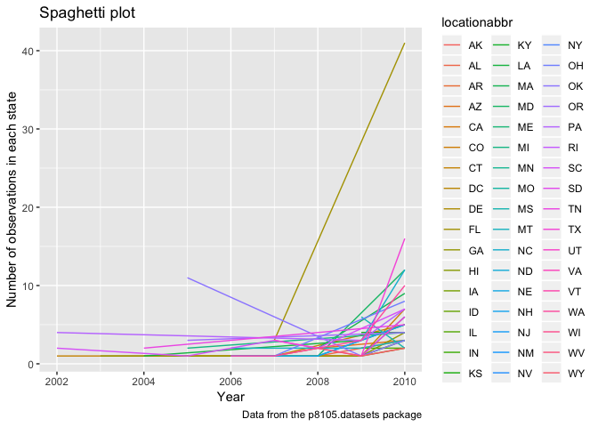
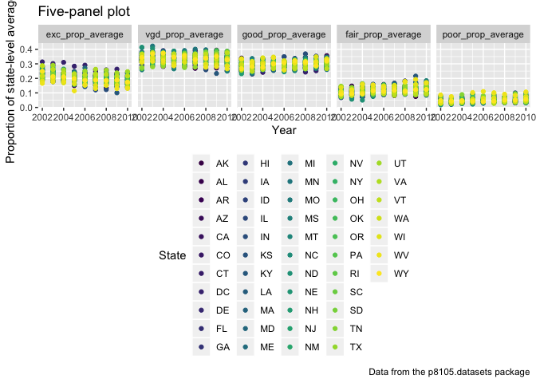

p8105\_hw3\_xy2397
================
Xue Yang
10/6/2018

Problem 1
=========

**Load the data**

``` r
library(p8105.datasets)
```

**Read and clean the data**

• format the data to use appropriate variable names; • focus on the “Overall Health” topic • include only responses from “Excellent” to “Poor” • organize responses as a factor taking levels from “Excellent” to “Poor”

``` r
brfss = 
  
  # read the data "brfss_smart2010" from the p8105.datasets package
  brfss_smart2010 %>% 
  
  # clean up variable names
  janitor::clean_names() %>% 
  
  # filter the data to only focus on "Overall Health" topic
  filter(., topic == "Overall Health") %>% 
  
   # mutate responses as a factor taking levels from “Excellent” to “Poor”
  mutate(., response = factor(response)) %>% 
  
  # include only responses from “Excellent” to “Poor”
  select(., year, locationabbr, locationdesc, response, data_value) %>%
  spread(key = "response", value = "data_value") %>% 
  
  # clean up variable names again
  janitor::clean_names()
```

**Answering the questions using this dataset**

• In 2002, which states were observed at 7 locations?

``` r
brfss_2002 = 
  brfss %>% 
  filter(year == "2002") %>%
  group_by(locationabbr) %>% 
  summarize(number = n()) %>% 
  filter(number == 7)


brfss_2002
```

    ## # A tibble: 3 x 2
    ##   locationabbr number
    ##   <chr>         <int>
    ## 1 CT                7
    ## 2 FL                7
    ## 3 NC                7

So we can see that states "CT", "FL" and "NC" were observed at 7 locations.

• Make a “spaghetti plot” that shows the number of observations in each state from 2002 to 2010.

``` r
  brfss %>% 
  group_by(year, locationabbr) %>% 
  summarize(number = n()) %>% 
  ggplot(aes(x = year , y = number, color = locationabbr)) +
  geom_line() +
  labs(
    title = "Spaghetti plot",
    x = "Year",
    y = "Number of observations in each state",
    caption = "Data from the p8105.datasets package"
  ) 
```



• Make a table showing, for the years 2002, 2006, and 2010, the mean and standard deviation of the proportion of “Excellent” responses across locations in NY State.

``` r
brfss %>% 
  filter(year %in% c("2002", "2006", "2010"), locationabbr == "NY") %>% 
  mutate(prop = excellent / (excellent + very_good + good + fair + poor)) %>% 
  group_by(year) %>% 
  summarize(mean = mean(prop, na.rm = TRUE),
            sd = sd(prop, na.rm = TRUE)) %>% 
  knitr::kable(digits = 3)
```

|  year|   mean|     sd|
|-----:|------:|------:|
|  2002|  0.241|  0.045|
|  2006|  0.225|  0.040|
|  2010|  0.227|  0.036|

• For each year and state, compute the average proportion in each response category (taking the average across locations in a state). Make a five-panel plot that shows, for each response category separately, the distribution of these state-level averages over time.

``` r
brfss %>% 
  mutate(exc_prop = excellent / (excellent + very_good + good + fair + poor)) %>%
  mutate(vgd_prop = very_good / (excellent + very_good + good + fair + poor)) %>%
  mutate(gd_prop = good / (excellent + very_good + good + fair + poor)) %>%
  mutate(fa_prop = fair / (excellent + very_good + good + fair + poor)) %>%
  mutate(pr_prop = poor / (excellent + very_good + good + fair + poor)) %>% 
  group_by(year, locationabbr) %>% 
  summarize(exc_prop_average = mean(exc_prop,na.rm = TRUE),
            vgd_prop_average = mean(vgd_prop, na.rm = TRUE),
            good_prop_average = mean(gd_prop, na.rm = TRUE),
            fair_prop_average = mean(fa_prop, na.rm = TRUE),
            poor_prop_average = mean(pr_prop, na.rm = TRUE)) %>% 
  gather(., key = "response", value = "average_prop", exc_prop_average:poor_prop_average) %>%    ggplot(aes(x = year, y = average_prop, color = locationabbr)) +
  geom_point()+
  facet_grid(~response) +
  labs(
    title = "Five-panel plot",
    x = "Year",
    y = "Proportion of state-level averages",
    caption = "Data from the p8105.datasets package"
  ) +
  viridis::scale_color_viridis(
    name = "State",
    discrete = TRUE
    ) + 
  theme(legend.position = "bottom")
```


