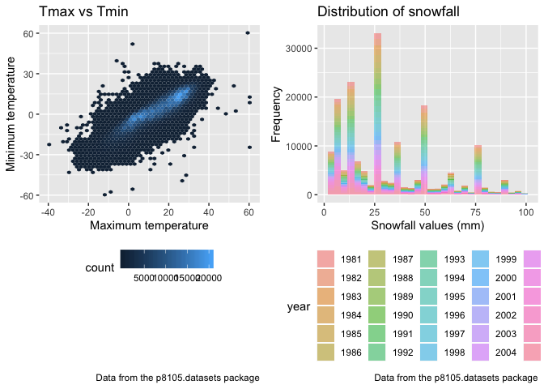

p8105\_hw3\_xy2397
================
Xue Yang
10/6/2018

Problem 1
=========

**Load the data**

``` r
library(p8105.datasets)
```

**Read and clean the data**

• format the data to use appropriate variable names; • focus on the “Overall Health” topic • include only responses from “Excellent” to “Poor” • organize responses as a factor taking levels from “Excellent” to “Poor”

``` r
brfss = 
  
  # read the data "brfss_smart2010" from the p8105.datasets package
  brfss_smart2010 %>% 
  
  # clean up variable names
  janitor::clean_names() %>% 
  
  # filter the data to only focus on "Overall Health" topic
  filter(., topic == "Overall Health") %>% 
  
   # mutate responses as a factor taking levels from “Excellent” to “Poor”
  mutate(., response = factor(response)) %>% 
  
  # include only responses from “Excellent” to “Poor”
  select(., year, locationabbr, locationdesc, response, data_value) %>%
  spread(key = "response", value = "data_value") %>% 
  
  # clean up variable names again
  janitor::clean_names()
```

**Answering the questions using this dataset**

• In 2002, which states were observed at 7 locations?

``` r
brfss_2002 = 
  brfss %>% 
  filter(year == "2002") %>%
  group_by(locationabbr) %>% 
  summarize(number = n()) %>% 
  filter(number == 7)


brfss_2002
```

    ## # A tibble: 3 x 2
    ##   locationabbr number
    ##   <chr>         <int>
    ## 1 CT                7
    ## 2 FL                7
    ## 3 NC                7

So we can see that states "CT", "FL" and "NC" were observed at 7 locations.

• Make a “spaghetti plot” that shows the number of observations in each state from 2002 to 2010.

``` r
  brfss %>% 
  group_by(year, locationabbr) %>% 
  summarize(number = n()) %>% 
  ggplot(aes(x = year , y = number, color = locationabbr)) +
  geom_line() +
  labs(
    title = "Spaghetti plot",
    x = "Year",
    y = "Number of observations in each state",
    caption = "Data from the p8105.datasets package"
  ) 
```


• Make a table showing, for the years 2002, 2006, and 2010, the mean and standard deviation of the proportion of “Excellent” responses across locations in NY State.

``` r
brfss %>% 
  filter(year %in% c("2002", "2006", "2010"), locationabbr == "NY") %>% 
  mutate(prop = excellent / (excellent + very_good + good + fair + poor)) %>% 
  group_by(year) %>% 
  summarize(mean = mean(prop, na.rm = TRUE),
            sd = sd(prop, na.rm = TRUE)) %>% 
  knitr::kable(digits = 3)
```

|  year|   mean|     sd|
|-----:|------:|------:|
|  2002|  0.241|  0.045|
|  2006|  0.225|  0.040|
|  2010|  0.227|  0.036|

• For each year and state, compute the average proportion in each response category (taking the average across locations in a state). Make a five-panel plot that shows, for each response category separately, the distribution of these state-level averages over time.

``` r
brfss %>% 
  mutate(exc_prop = excellent / (excellent + very_good + good + fair + poor)) %>%
  mutate(vgd_prop = very_good / (excellent + very_good + good + fair + poor)) %>%
  mutate(gd_prop = good / (excellent + very_good + good + fair + poor)) %>%
  mutate(fa_prop = fair / (excellent + very_good + good + fair + poor)) %>%
  mutate(pr_prop = poor / (excellent + very_good + good + fair + poor)) %>% 
  group_by(year, locationabbr) %>% 
  summarize(exc_prop_average = mean(exc_prop,na.rm = TRUE),
            vgd_prop_average = mean(vgd_prop, na.rm = TRUE),
            good_prop_average = mean(gd_prop, na.rm = TRUE),
            fair_prop_average = mean(fa_prop, na.rm = TRUE),
            poor_prop_average = mean(pr_prop, na.rm = TRUE)) %>% 
  gather(., key = "response", value = "average_prop", exc_prop_average:poor_prop_average) %>%    ggplot(aes(x = year, y = average_prop, color = locationabbr)) +
  geom_point()+
  facet_grid(~response) +
  labs(
    title = "Five-panel plot",
    x = "Year",
    y = "Proportion of state-level averages",
    caption = "Data from the p8105.datasets package"
  ) +
  viridis::scale_color_viridis(
    name = "State",
    discrete = TRUE
    ) + 
  theme(legend.position = "bottom")
```


Problem 2
=========

**Load and read the data**

``` r
data("instacart")
```

The goal is to do some exploration of this dataset. To that end, write a short description of the dataset, noting the size and structure of the data, describing some key variables, and giving illstrative examples of observations.

The dataset "Instacart" contains online grocery orders from instacart users. The size of the dataset is 1384617 rows x 15 columns, which means that it contains 1384617 records of online orders about 15 variables. There are some key variables such as id (order\_id, product\_id, user\_id, aisle\_id, department\_id) for identifier, order\_number for the order sequence number for this user, order\_dow for the day of the week on which the order was placed, order\_hour\_of\_day for the hour of the day on which the order was placed and product\_name for the name of product.

For example for the user whose order\_id is 1, he(she) ordered online for 8 products, among those there were 4 products reordered. This order belongs to train evaluation set and this order is placed on Thursday for 10 hours, and it's 9 days since this user last order. Then, do or answer the following (commenting on the results of each):

• How many aisles are there, and which aisles are the most items ordered from?

``` r
instacart %>% 
  group_by(aisle) %>% 
  summarize(number = n()) %>% 
  top_n(5) 
```

    ## Selecting by number

    ## # A tibble: 5 x 2
    ##   aisle                      number
    ##   <chr>                       <int>
    ## 1 fresh fruits               150473
    ## 2 fresh vegetables           150609
    ## 3 packaged cheese             41699
    ## 4 packaged vegetables fruits  78493
    ## 5 yogurt                      55240

So there are totally 134 aisles there, and fresh vegetables is the most items ordered from for 150609 orders and following is fresh fruits for 150473 orders.

• Make a plot that shows the number of items ordered in each aisle. Order aisles sensibly, and organize your plot so others can read it.

``` r
instacart %>% 
  group_by(aisle_id) %>% 
  summarise(number = n()) %>% 
  ggplot(aes(x = aisle_id, y = number, color = aisle_id)) +
  geom_point()+
  labs(
    title = "Aisle plot",
    x = "Aisle_id",
    y = "Number of items ordered in each aisle",
    caption = "Data from the p8105.datasets package"
  ) +
  viridis::scale_color_viridis(
    name = "Aisle_id",
    discrete = FALSE,
  ) +
  scale_x_continuous(
    breaks = c(0, 10, 20, 30, 40, 50, 60, 70, 80,
               90, 100, 110, 120, 130)
  ) +
  theme(legend.position = "bottom")
```


Since there are 134 different kinds of aisles, it is not readale to put the name of aisles in x-axis, so we use aisle\_id instead of aisle name to represent different kinds of aisles and color the number of items differently to indicate different aisles. In this way, the plot is more readable for others.

• Make a table showing the most popular item aisles “baking ingredients”, “dog food care”, and “packaged vegetables fruits”

``` r
instacart %>% 
  filter(aisle %in% c("baking ingredients", "dog food care", "packaged vegetables fruits" ) ) %>% 
  group_by(aisle, product_name) %>% 
  summarize(number = n()) %>% 
  top_n(1) %>% 
  knitr::kable(digits = 3)
```

    ## Selecting by number

| aisle                      | product\_name                                 |  number|
|:---------------------------|:----------------------------------------------|-------:|
| baking ingredients         | Light Brown Sugar                             |     499|
| dog food care              | Snack Sticks Chicken & Rice Recipe Dog Treats |      30|
| packaged vegetables fruits | Organic Baby Spinach                          |    9784|

We can first filter these three types of aisles from the full dataset and then grouped the dataset by these three different aisles and product\_name. When we summarize the number of each group and select the largest number of each group, we can now get the most popular item in each of the three aisles.

From the table, we can find that the most popular item in "baking ingredients" is "Light Brown Sugar" which saled for 499 orders, the most popular item in "dog food care" is "Snack Sticks Chicken & Rice Recipe Dog Treats" which saled for 30 orders and he most popular item in "packaged vegetables fruits" is "Organic Baby Spinach" which saled for 9784 orders.

• Make a table showing the mean hour of the day at which Pink Lady Apples and Coffee Ice Cream are ordered on each day of the week; format this table for human readers (i.e. produce a 2 x 7 table).

``` r
instacart %>% 
  filter(product_name %in% c("Pink Lady Apples", "Coffee Ice Cream")) %>% 
  group_by(product_name, order_dow) %>% 
  summarize(mean_hour_day = mean(order_hour_of_day, na.rm = TRUE)) %>% 
  spread(key = "order_dow", value = "mean_hour_day") %>% 
  knitr::kable(digits = 3)
```

| product\_name    |       0|       1|       2|       3|       4|       5|       6|
|:-----------------|-------:|-------:|-------:|-------:|-------:|-------:|-------:|
| Coffee Ice Cream |  13.774|  14.316|  15.381|  15.318|  15.217|  12.263|  13.833|
| Pink Lady Apples |  13.441|  11.360|  11.702|  14.250|  11.552|  12.784|  11.938|

From the table we can easily read the mean hours of the day at each day of the week users spend on product "Coffee Ice Cream" and "Pink Lady Apples". We can find that people spend most hours for "Coffee Ice Cream" at Tuesday and for "Pink Lady Apples" at Wednesday.

Problem 3
=========

``` r
data("ny_noaa")
ny_noaa
```

    ## # A tibble: 2,595,176 x 7
    ##    id          date        prcp  snow  snwd tmax  tmin 
    ##    <chr>       <date>     <int> <int> <int> <chr> <chr>
    ##  1 US1NYAB0001 2007-11-01    NA    NA    NA <NA>  <NA> 
    ##  2 US1NYAB0001 2007-11-02    NA    NA    NA <NA>  <NA> 
    ##  3 US1NYAB0001 2007-11-03    NA    NA    NA <NA>  <NA> 
    ##  4 US1NYAB0001 2007-11-04    NA    NA    NA <NA>  <NA> 
    ##  5 US1NYAB0001 2007-11-05    NA    NA    NA <NA>  <NA> 
    ##  6 US1NYAB0001 2007-11-06    NA    NA    NA <NA>  <NA> 
    ##  7 US1NYAB0001 2007-11-07    NA    NA    NA <NA>  <NA> 
    ##  8 US1NYAB0001 2007-11-08    NA    NA    NA <NA>  <NA> 
    ##  9 US1NYAB0001 2007-11-09    NA    NA    NA <NA>  <NA> 
    ## 10 US1NYAB0001 2007-11-10    NA    NA    NA <NA>  <NA> 
    ## # ... with 2,595,166 more rows

The goal is to do some exploration of this dataset.

To that end, write a short description of the dataset, noting the size and structure of the data, describing some key variables, and indicating the extent to which missing data is an issue.

This dataset "ny\_noaa" provides some weather data, it contains records from 747 different weather stations for about datas from 10,957 obervational days. The size of the dataset is 2595176 rows x 7 columns. The key variables are id (weather station ID), date (date of observation), prcp (precipitation for tenths of mm), snow (snowfall for mm), snwd (snow depth for mm) and tmax and tmin (maximum and mimimum temperature for tenths of degrees C). At last, we calculate the proportion of missing value fro each vairable, we have 0.0561958 for prop, 0.146896 for snow, 0.2280331 for snwd, 0.4371025 for tmax and 0.4371264 for tmin.

``` r
ny_noaa %>% 
  group_by(id) %>% 
  summarise(number = n())
```

    ## # A tibble: 747 x 2
    ##    id          number
    ##    <chr>        <int>
    ##  1 US1NYAB0001   1157
    ##  2 US1NYAB0006    852
    ##  3 US1NYAB0010    822
    ##  4 US1NYAB0016    214
    ##  5 US1NYAB0017    459
    ##  6 US1NYAB0021    365
    ##  7 US1NYAB0022    273
    ##  8 US1NYAB0023    365
    ##  9 US1NYAB0025    215
    ## 10 US1NYAL0002    549
    ## # ... with 737 more rows

``` r
ny_noaa %>% 
  group_by(date) %>% 
  summarise(number = n()) 
```

    ## # A tibble: 10,957 x 2
    ##    date       number
    ##    <date>      <int>
    ##  1 1981-01-01    236
    ##  2 1981-01-02    236
    ##  3 1981-01-03    236
    ##  4 1981-01-04    236
    ##  5 1981-01-05    236
    ##  6 1981-01-06    236
    ##  7 1981-01-07    236
    ##  8 1981-01-08    236
    ##  9 1981-01-09    236
    ## 10 1981-01-10    236
    ## # ... with 10,947 more rows

``` r
prcp_na =
  ny_noaa %>% 
  filter(is.na(prcp)) %>% 
  nrow()
prcp_prop = prcp_na/nrow(ny_noaa)
prcp_prop
```

    ## [1] 0.0561958

``` r
snow_na =
  ny_noaa %>% 
  filter(is.na(snow)) %>% 
  nrow()
snow_prop = snow_na/nrow(ny_noaa)
snow_prop
```

    ## [1] 0.146896

``` r
snwd_na =
  ny_noaa %>% 
  filter(is.na(snwd)) %>% 
  nrow()
snwd_prop = snwd_na/nrow(ny_noaa)
snwd_prop
```

    ## [1] 0.2280331

``` r
tmax_na =
  ny_noaa %>% 
  filter(is.na(tmax)) %>% 
  nrow()
tmax_prop = tmax_na/nrow(ny_noaa)
tmax_prop
```

    ## [1] 0.4371025

``` r
tmin_na =
  ny_noaa %>% 
  filter(is.na(tmin)) %>% 
  nrow()
tmin_prop = tmin_na/nrow(ny_noaa)
tmin_prop
```

    ## [1] 0.4371264

Then, do or answer the following (commenting on the results of each):

• Do some data cleaning. Create separate variables for year, month, and day. Ensure observations for temperature, precipitation, and snowfall are given in reasonable units. For snowfall, what are the most commonly observed values? Why?

``` r
noaa = 
  ny_noaa %>%
  separate(date, into = c("year", "month", "day"), sep = "-")
```

``` r
noaa %>%
  count(snow) %>% 
  top_n(5) 
```

    ## Selecting by n

    ## # A tibble: 5 x 2
    ##    snow       n
    ##   <int>   <int>
    ## 1     0 2008508
    ## 2    13   23095
    ## 3    25   31022
    ## 4    51   18274
    ## 5    NA  381221

So for snowfall, 0 is the most commonly observed value, since 0 has been observed for 2008508 times from the dataset. The second commonly observed value id 25 and it was observed for 31022 times.

• Make a two-panel plot showing the average max temperature in January and in July in each station across years. Is there any observable / interpretable structure? Any outliers?

``` r
noaa %>% 
  filter(month %in% c("01", "07")) %>% 
  mutate(tmax = as.numeric(tmax)) %>% 
  group_by(id, month) %>% 
  summarize(average_tmax = mean(tmax, na.rm = TRUE)) %>% 
  filter(!is.na(average_tmax)) %>% 
  ggplot(aes(x = id, y = average_tmax, color = month)) +
  geom_point(alpha = 0.5) +
  geom_line() +
  facet_grid(~month) +
  labs(
    title = "Average max temperature two-panel plot",
    x = "Weather Station",
    y = "Average max temperature across year (tenths of degrees CC)",
    caption = "Data from the p8105.datasets package"
  ) +
  theme(legend.position = "bottom")
```

    ## geom_path: Each group consists of only one observation. Do you need to
    ## adjust the group aesthetic?
    ## geom_path: Each group consists of only one observation. Do you need to
    ## adjust the group aesthetic?

 When draw a plot for average max temperature for in January and in July in each station across years, we first delete all the missing value. From the two-panel plot we can easily find that the average temperature recorded from each station in January is lower than in July, it's obviously, since it's winter in January and summer in July. And there are also some outliers in January which may be explained that there are few countries and territories are especially cold in January.

• Make a two-panel plot showing (i) tmax vs tmin for the full dataset (note that a scatterplot may not be the best option); and (ii) make a plot showing the distribution of snowfall values greater than 0 and less than 100 separately by year.

``` r
tmax_tmin =
  noaa %>% 
  filter(!is.na(tmax), !is.na(tmin)) %>% 
  ggplot(aes(x = tmax, y = tmin)) +
  geom_hex(bins = 300) +
  labs(
    title = "Tmax vs Tmin",
    x = "Maximum temperature",
    y = "Minimum temperature",
    caption = "Data from the p8105.datasets package"
  ) +
  scale_x_discrete(
    limits = c(-250, 250)
  ) +
  theme(legend.position = "bottom")

snowfall =
  noaa %>% 
  filter(snow %in% 1:99) %>% 
  ggplot(aes(x = snow, fill = year)) +
  geom_histogram(alpha = 0.5) +
  labs(
    title = "Distribution of snowfall",
    x = "Snowfall values (mm)",
    y = "Frequency",
    caption = "Data from the p8105.datasets package"
  ) +
  theme(legend.position = "bottom")

tmax_tmin + snowfall
```

    ## Warning: Removed 1431533 rows containing non-finite values (stat_binhex).

    ## `stat_bin()` using `bins = 30`. Pick better value with `binwidth`.



So when we deal with the
